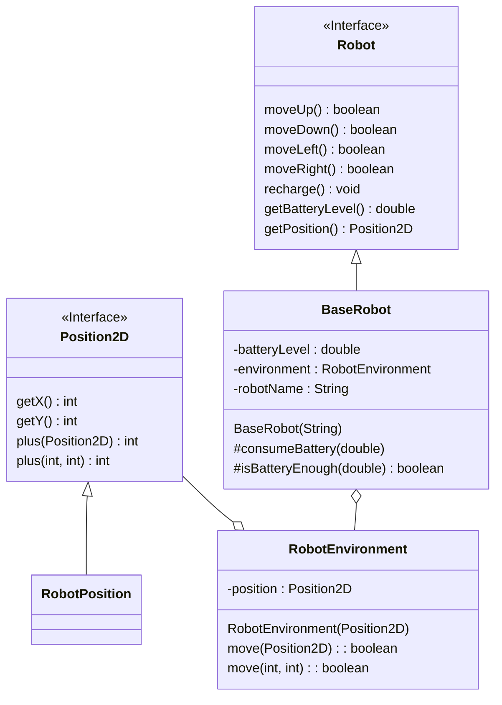
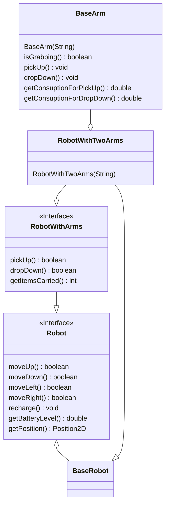

# Extension of existing software with provided design

Take a look at the contents of `it.unibo.oop.lab04.robot.base`. It contains classes and interfaces modeling a robot that can move into an environment.
Use the following UML to understand how the system is designed, and use `TestRobots` to better understand how it works.

https://mermaid.live/edit#pako:eNp1lE1rg0AQhv-KbC8G4qVHCTmE9FAIpSQUWvCy6qgL7o7shyWk-e_duBrXaPYk87zuvPOhF5JhDiQmWU2V2jNaSsoTEdjziYpphuJ1H2z-oig4Yop6CM4kUYRO8SZaJlFwENqJdlRBRwIcbplpHO_S3OWObDbvQoMsaAbbbfAUjE4c7crx_V1c_HZK0N_hKmBD8j728xhraqPC8YolaiPrW9hjV9-Aq8vLzbGFr8ZmShFroGJK9vgrnrEDFPoZO7KyWoQSsorKEixrkeWTendU2_6dD9BCbXmOJq1hohhqt_Sxv5Mqxwl7lUapd38Qz-6PYFwCi5f3ohPKG_qgHKzspCUT5QjvqUNHViN6yVAow6GvM3QGfAFTPXsTaMpqUEzbOJ-n53JScNP3yNp8bNd9x713_dWajnOydPHyyL3Vi2eGyZpwkJyy3H7ZncWE6Ao4JCS2jzkU1NQ6IYm4Wik1Gk9nkZFYSwNrYpqcauj_BSQuaK3g-g_oJU_W

Using (without modifying) the existing classes, and using the provided following UML design scheme,
create a new `interface RobotWithArms extends Robot` with:
* `boolean pickUp()`: picks an object, returns `true` if the action is successful
* `boolean dropDown()`: drops an object, returns `true` if the action is successful
* `int getCarriedItemsCount()`: returns the number of objects this robot is currently transporting

https://mermaid.live/edit#pako:eNqFk8FuwjAMhl-lymlI9LJjhZAG1SYkDgg27dJL2rhttCauEheEgHdfChTa0bKckny_Y_-2cmAJCmABSwpubSh5ZriKtOfWGmMkb3L0fW_GLZyPLfItKf_c4ZtR1vP943RQdFe06GSy0AQm5QlM_wPNI8-S9wjretzJcXwIuijOnq8-D5ereincwlf5MvJixAK47pIQd3qILSGlIbaWWd4LDSQ5Nxk4tkUp7iADmnFyzdgvYQuF4wKruICOYoVWksS6pGb7Gl4UpweXt3G03JYy-el3KwyWQ25d5gWBsnNujAThJFLTs7TNtFqZ_7KXDRmps1HPM80sW9HXq25QvaT9MDyO3WVf4Te73V63vD4MYY7aVmXd2Xc0qya-ZxYdYXh_sS11ttiYKTCKS-H-3dlRxCgHBREL3FZAyquCIhbpk5PyinCz1wkLyFQwZlUpOMH1p7Ig5YWF0y_j4DO1

Using (without modifying) the existing classes and the provided UML design scheme,
create a new `class BasicArm` which models a robotic arm.
Every arm can lift a single object at a time, and it requires some power to lift an object and some power to drop it down.

Using (without modifying) the existing classes and the provided UML design scheme,
create a new `class RobotWithTwoArms extends BaseRobot implements RobotWithArms` which models a robot with two arms.
When `pickUp()` is invoked, the robot lifts an object, raising the count of objects it is transporting, and occupying one of its arms.
When all the arms are occupied, `pickUp()` returns `false`.
Similarly, `dropDown()` returns `false` if the robot's arms are empty.
If the robot is transporting objects, its battery consumption is higher.

Use `TestRobotWithArms` to verify that the classes realized work correctly before calling the teacher for a correction.
